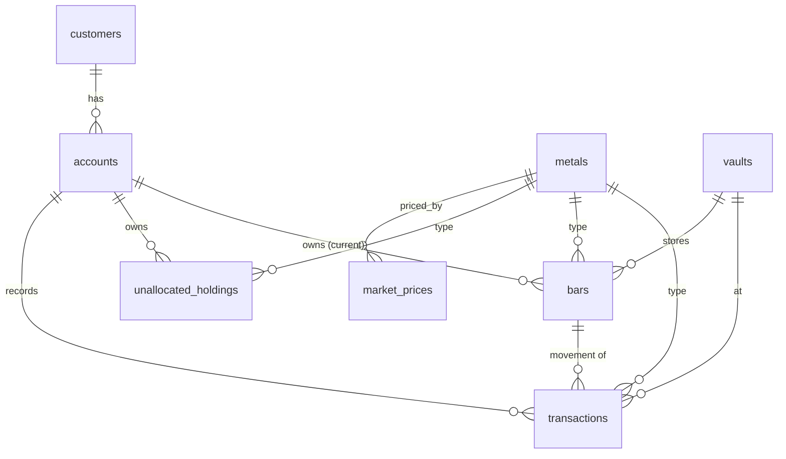

# Bare Metals — Digital Asset Custody Platform

A demo prototype for **Bare Metals Pvt**, a precious-metals custodian. The platform tracks customer accounts, deposits, withdrawals, valuations, and supports both **allocated** (bar-level) and **unallocated** (pooled) storage across gold, silver, and platinum.

> Built for [Maldives Securities Depository — Assessment 2](./docs/Assessment%202.pdf). The full design rationale, schema, edge-case analysis, and rubric mapping live in [`docs/bare-metals-spec.md`](./docs/bare-metals-spec.md).

---

## Tech stack

| Layer | Choice | Why |
|---|---|---|
| Framework | Next.js 16.2 (App Router, RSC) + React 19 | Server components for reads, route handlers for mutations |
| Language | TypeScript 5 (strict) | Type safety matters for financial data |
| Runtime | Node 20+, **bun** for install / scripts | Fast install; ships with `bun:sqlite` if we ever need it |
| Database | **SQLite** via `better-sqlite3` (file-based, WAL) | Zero local setup; everything the demo exercises (transactions, FKs, CHECK, UNIQUE, indexes) is supported. Schema is portable to Postgres. |
| ORM | Drizzle ORM | SQL-first, transparent transactions, decimal-as-text round-tripping |
| Validation | Zod | Single source of truth for API + form |
| Decimal math | `decimal.js` | Never use JS `number` for money or weights |
| UI | shadcn v4 (`base-nova` style on `@base-ui/react`) + Tailwind v4 | Polished, accessible primitives; theme tokens in `app/globals.css` |
| Forms | React Hook Form + Zod resolver | |
| Component install | shadcn MCP server (`.mcp.json`) | `bunx shadcn@latest add @shadcn/<name>` |

---

## Setup

```bash
bun install
cp .env.example .env            # adjust DATABASE_URL if you want a different file path
bun run db:migrate              # apply Drizzle migrations
bun run db:seed                 # seed metals, vaults, demo customers + accounts
bun run dev                     # http://localhost:3000
```

Useful scripts:

```bash
bun run db:generate     # generate a new migration from schema changes
bun run db:migrate      # apply migrations
bun run db:seed         # reseed the DB (clears + reinserts demo rows)
bun run db:reset        # rm + migrate + seed (full clean slate)
bun run db:studio       # open Drizzle Studio
bun run lint            # eslint
```

The default DB path is `./bare-metals.db` (gitignored). Stop the dev server before running `db:reset` — `better-sqlite3` holds an open file handle that won't notice the file being recreated.

---

## Architecture

```
┌─────────────────────────────────────────────┐
│  Pages (Server Components)                  │  reads via DB layer directly
│  Client Components (forms, tables)          │  mutate via Route Handlers
└────────────────────┬────────────────────────┘
                     │
┌────────────────────▼────────────────────────┐
│  Route Handlers (app/api/**)                │  thin: parse → validate → service
└────────────────────┬────────────────────────┘
                     │
┌────────────────────▼────────────────────────┐
│  Service layer (lib/services/**)            │  business logic + transactions
└────────────────────┬────────────────────────┘
                     │
┌────────────────────▼────────────────────────┐
│  Data access (lib/db/**)                    │  Drizzle queries, schema, types
└────────────────────┬────────────────────────┘
                     │
                  SQLite (WAL)
```

Layer responsibilities:

| Layer | Responsibility |
|---|---|
| **Server components** | Server-side reads via the DB layer. No business logic. |
| **Client components** | Interactive UI (forms, tables). Call route handlers. |
| **Route handlers** | HTTP I/O. Parse, validate (Zod), delegate to service. |
| **Services** | Business logic, transactions, audit logging. |
| **DB layer** | Drizzle schema, query builders, types. |

### Data model



Key tables:

- **`metals`** — gold (`XAU`), silver (`XAG`), platinum (`XPT`). Adding a metal is one row. Every other table references `metal_id`.
- **`market_prices`** — append-only spot prices per metal. Latest row by `effective_at` is the active rate.
- **`unallocated_holdings`** — `(account_id, metal_id, quantity_kg)`. One row per account+metal. CHECK enforces non-negative.
- **`bars`** — one row per physical bar with `serial_number` (UNIQUE), `weight_kg`, `purity`, `vault_id`, `current_account_id`, `status`.
- **`transactions`** — the immutable ledger: every deposit and withdrawal writes one row. Append-only in application code.

---

## Design decisions worth highlighting

These are the deliberate calls behind the implementation. They show up in the spec and on the rubric.

### 1. Storage model is a property of *transactions*, not customers

Reading the brief literally, "retail = unallocated, institutional = allocated" looks like a 1:1 mapping. Real custodial businesses allow hybrid holdings — institutions sometimes carry small unallocated positions alongside their bars. The system therefore lets any account hold either or both. `client_type` is informational and only defaults the form's storage selector.

### 2. Single `transactions` ledger, not separate `deposits` / `withdrawals` tables

The ledger pattern. Cleaner queries, easier history views, and a future "transfer" feature would naturally fit as a paired entry. The transaction's `type` column distinguishes deposit vs withdrawal.

### 3. Pool share is *derived*, not stored

Storing "Customer A holds 60% of the pool" forces an update to every customer row on every deposit. Instead we store `quantity_kg` per (account, metal) and compute share at read time as `customer.quantity_kg / SUM(quantity_kg)`. This trade saves write amplification at the cost of one aggregate read on display.

### 4. All financial math in `decimal.js` — never `number`

The DB stores money/weight as **TEXT** (Drizzle `numeric()` semantics on SQLite). The service layer parses to `Decimal`, computes, and serialises back to a fixed-precision (8 decimal places) string. JavaScript's `number` is never used for any quantity, weight, or price.

### 5. Append-only ledger with denormalised projections

`unallocated_holdings.quantity_kg` and `bars.status` are caches over the immutable `transactions` table. The ledger is the source of truth. A future reconciliation job could rebuild caches from the ledger if drift is ever detected.

### 6. SQLite + WAL instead of Postgres

The brief explicitly allows non-Postgres. SQLite gives ACID transactions, foreign keys, CHECK / UNIQUE / indexes — everything the schema actually exercises. Concurrency model differs (writers serialise via `BEGIN IMMEDIATE` instead of row-level `SELECT ... FOR UPDATE`), which is conservative-by-default and acceptable for a custody system. Schema is structurally portable to Postgres if scale demands it.

### 7. No authentication in scope

Demo prototype — the API is open. Adding auth (NextAuth / OAuth proxy / JWT) is a clear next step.

---

## Edge cases handled

The brief asks for at least 5. The spec documents 8.

| # | Scenario | How the system handles it |
|---|---|---|
| 1 | Withdraw more than balance | `recordWithdrawal` reads the holding inside the txn, throws `InsufficientBalanceError` (422). DB CHECK on `quantity_kg >= 0` is the final safety net. |
| 2 | Concurrent withdraw of the same bar | SQLite serialises writers; the second txn sees `status='withdrawn'` and the service throws `BarAlreadyWithdrawnError` (409). |
| 3 | Withdraw a bar from the wrong account | Service checks `bar.current_account_id === request.accountId`. Returns 404 (`BarOwnershipError`) — does not leak the bar's existence to other accounts. |
| 4 | Concurrent unallocated deposits to the same account+metal | Inside a txn the existing holding is read, decimal-summed, and upserted. SQLite's writer lock serialises the conflicting write. |
| 5 | Deposit of zero or negative quantity | Zod rejects with 422 at the route boundary. DB CHECK on `quantity_kg > 0` in the `transactions` table is defence-in-depth. |
| 6 | Duplicate bar serial number | UNIQUE constraint on `bars.serial_number`. The service catches the SQLite UNIQUE violation and translates to `DuplicateSerialError` (409). |
| 7 | Valuation when no market price exists | `valuateAccount` returns `valueUSD: null` for unpriced metals. The UI renders an "Unpriced" pill — never silently zero. |
| 8 | Currency / weight precision | All math via `decimal.js` (40-digit precision, banker's rounding). DB stores `NUMERIC(20,8)` semantics as TEXT round-tripping through `Decimal.toFixed(8)`. |

A ninth, **bar transfer between accounts**, is intentionally out of scope. It would be a paired withdrawal+deposit (or a new transaction `type`) in a future iteration.

---

## API examples

All endpoints return `{ data }` on success or `{ error: { code, message, details? } }` on failure.

```bash
# Create a customer
curl -s -X POST http://localhost:3000/api/customers \
  -H 'Content-Type: application/json' \
  -d '{"name":"Acme Holdings","email":"ops@acme.mv","clientType":"institutional"}'

# Open an account for that customer
curl -s -X POST http://localhost:3000/api/accounts \
  -H 'Content-Type: application/json' \
  -d '{"customerId":"<uuid>"}'

# Set a spot price
curl -s -X POST http://localhost:3000/api/market-prices \
  -H 'Content-Type: application/json' \
  -d '{"metalCode":"XAU","pricePerKg":"66250.00"}'

# Unallocated deposit (10.5 kg of gold)
curl -s -X POST http://localhost:3000/api/deposits \
  -H 'Content-Type: application/json' \
  -d '{
    "storageType":"unallocated",
    "accountId":"<uuid>",
    "metalCode":"XAU",
    "vaultId":1,
    "quantityKg":"10.5"
  }'

# Allocated deposit (a specific bar)
curl -s -X POST http://localhost:3000/api/deposits \
  -H 'Content-Type: application/json' \
  -d '{
    "storageType":"allocated",
    "accountId":"<uuid>",
    "metalCode":"XAU",
    "vaultId":1,
    "bar":{"serialNumber":"AU-2026-00042","weightKg":"12.4567","purity":"0.9999"}
  }'

# Unallocated withdrawal
curl -s -X POST http://localhost:3000/api/withdrawals \
  -H 'Content-Type: application/json' \
  -d '{
    "storageType":"unallocated",
    "accountId":"<uuid>",
    "metalCode":"XAU",
    "vaultId":1,
    "quantityKg":"2.5"
  }'

# Allocated withdrawal (by bar id)
curl -s -X POST http://localhost:3000/api/withdrawals \
  -H 'Content-Type: application/json' \
  -d '{"storageType":"allocated","accountId":"<uuid>","barId":"<uuid>"}'

# Inspect an account (portfolio + holdings + recent ledger entries + valuation)
curl -s http://localhost:3000/api/accounts/<uuid>

# Filter the ledger
curl -s 'http://localhost:3000/api/transactions?accountId=<uuid>&type=deposit&perPage=20'

# Latest spot price per metal
curl -s http://localhost:3000/api/market-prices/current

# Price history for one metal
curl -s 'http://localhost:3000/api/market-prices?metalCode=XAU'
```

---

## Project structure

```
.
├── app/                            # Next.js App Router
│   ├── (pages)/                    # dashboard, customers, accounts, admin
│   └── api/                        # route handlers
├── components/
│   ├── ui/                         # shadcn primitives
│   └── domain/                     # AccountSummary, MetalMark, Field, forms…
├── lib/
│   ├── db/                         # Drizzle schema, client, seed
│   ├── services/                   # customer, account, deposit, withdrawal, valuation, market-price
│   ├── validation/                 # Zod schemas
│   ├── api/                        # route handler wrapper, client fetch helper
│   ├── decimal.ts                  # decimal.js helpers
│   ├── format.ts                   # display helpers (fmtKg, fmtUSD, fmtPurity, …)
│   └── errors.ts                   # DomainError + subclasses
├── drizzle/                        # generated migrations + meta
└── docs/
    ├── Assessment 2.pdf
    └── bare-metals-spec.md         # the full technical spec (v1.2)
```

---

## Possible enhancements

- **Authentication & RBAC** — operators, customers, auditors with separate scopes.
- **Real market data feed** — e.g., LBMA / external oracle instead of manual price entry.
- **Bar transfer between accounts** — paired withdrawal+deposit or a new transaction type.
- **Reconciliation job** — periodic rebuild of `unallocated_holdings` and `bars.status` from the ledger to detect drift.
- **Multi-currency** — quote prices in MVR / EUR / GBP per customer preference.
- **Move to Postgres** — Drizzle dialect swap; schema is portable. Worth doing if writer concurrency becomes a bottleneck.
- **Soft-delete + audit log** for non-financial events (price edits, customer profile changes) for compliance.
- **Tests** — Vitest + a throwaway DB. The 8 edge cases are the natural test seam.

---

## License

Demo / assessment submission. Not licensed for production use.
